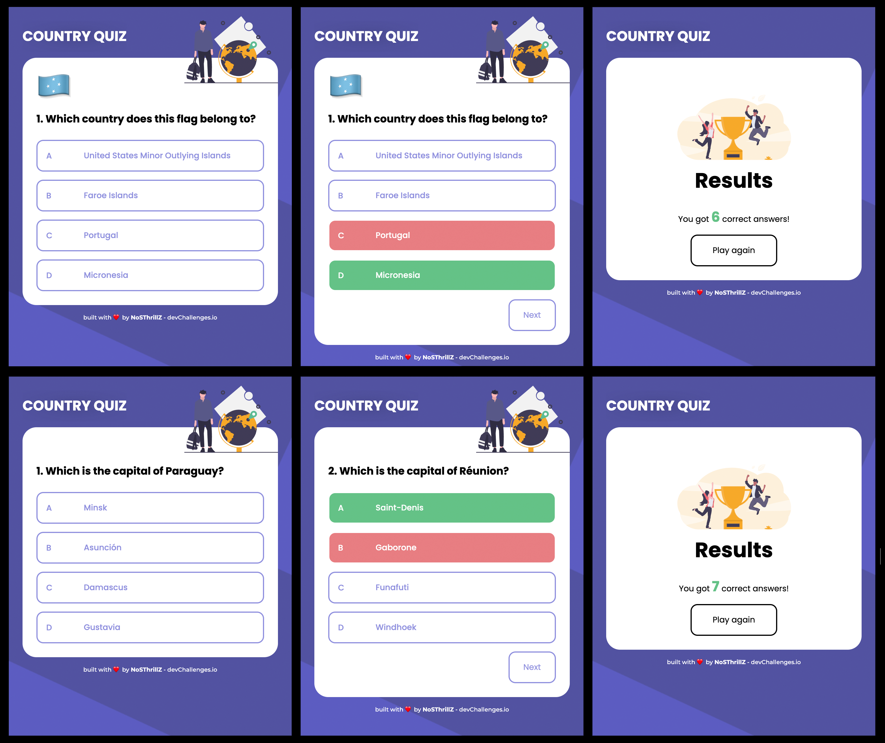

# Quizzountry - Countries quiz app

I build this app in response to the [challenge](https://devchallenges.io/challenges/Bu3G2irnaXmfwQ8sZkw8) from devChallenges.io. It was also my first-ever project with TypeScript.

>**Table of Contents**
>*   [Live preview](#live-preview)
>*   [User stories](#user-stories)
>*   [Tech stack](#tech-stack)
>*   [Screenshots](#screenshots)
>*   [Install and run](#install-and-run)

## Live preview

Check out the live deployment hosted on Vercel: [quizzountry.vercel.app](http://quizzountry.vercel.app/).

## User stories

Quoted from the devChallenges.io:
- User story: I can see at least 2 types of questions: a city is the capital of.. or a flag belong to country..
- User story: I can see select an answer
- User story: I can see if my answer is correct or incorrect
- User story: When I answer correctly, I can move on to the next question
- User story: I can play again

- User story: When I answer incorrectly, I can see my results and try again --- I have not implemented this, since it no sense to me for a quizzing app. What's the point in clicking the right answer after it was revealed?

## Tech stack

I built this using the following:
-  **React.js**
-  **TypeScript**
-  SCSS and styled-components

## Screenshot

* Mobile flow

    

## Install and run

1. Get the code:

    ```
    git clone https://github.com/nosthrillz/quizzountry
    ```

2. Install dependencies:

    ```
    npm i
    ```
    OR

    ```
    yarn i
    ```

3. Run the app:

    ```
    npm start
    ```
    OR

    ```
    yarn start
    ```